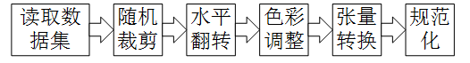

# Data pipeline

此文档简要说明数据集格式，读取以及数据增强。

## Date preparation

数据集主要分为VOC和COCO两种格式。

- VOC
XML格式标注边界框，使用`voc_label.py`转换成`.pkl`标注文件，标注格式采用YOLO的格式，即class id(从0开始),center_x,center_y,w,h(除以图像长宽归一化)。 

- COCO
主要利用pycocotools库实现。Cityscapes数据集标注先转换成COCO，使用`dataset/cityscapes/tools/convert_cityscapes_to_coco.py`。 
COCO标注格式需转换成YOLO格式，使用`utils.bbox.AnnoToNumpy()`函数。

## Transform

- 随机裁剪
`RandomCrop`
四周随机裁剪一定比例内像素
`SSDCrop`
随机裁剪，保证长宽比在[0.5,2]间，和目标框最小IoU(0.1,0.3,0.5,0.7,0.9)，保留目标中心在裁剪后图像内的目标框
`RC`
模仿优图OneStageDet里的裁剪（不很懂，会改变原图比例，有效图像尺度变化大）
- 水平翻转
`HFlip`
- 对比度、饱和度、HUE
`ColorJitter`
- 缩放
`Resize_Pad`
- Tensor转换
`ToTensor`
- 规范化
`Normalize`