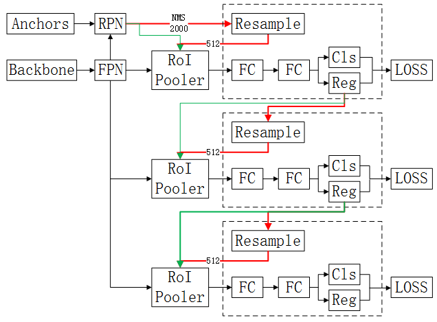

# Model pipeline

此文档简要说明各模型的组成以及训练推理过程。

## Model component

模型组成主要分为基础网络`backbone`，颈部网络`neck`，头部网络`head`，RoI池化`roi`以及插件`plugins`。

更多细节可查看[此文档](../littlenet/README.md)。

---

## YOLO

图中是YOLOv3的pipeline，主要包含backbone，虚线框head，anchors，loss四个部分。 
backbone网络现主要支持Darknet（见`backbone.Darknet53`类）和MobileNet（见`backbone.MobileNetv2`类）。 
head网络采用YOLOv3模型，从backbone网络提取到3层feature map，顶层feature map通过upsample之后和下一层concat结合。
最后Conv输出YOLO结果，`channel num=anchor num ×（5+class num）`。 
anchors通过聚类得到，除特殊说明外，默认采用论文中的anchors。anchors通过anchors mask分布到各层检测结果。 
loss（见`loss.YOLOLoss`类），**训练**时，**匹配策略**为每个gt box只和IoU最大的anchor匹配，
同时忽略那些IoU不是最大但和predict box的IoU大于阈值（默认0.5）的anchor，其他的anchor视为负样本。没有采用任何样本重采样技术。
**box预测**公式$\begin{matrix} \sigma(t^{xy})=g^{xy}-\lfloor a^{xy}\rfloor \\ t^{wh}=ln(\frac{g^{wh}}{a^{wh}}) \end{matrix}$，
**xy输出接sigmoid，anchor的xy附在每个cell的左上顶点而不是中心**。
**Loss公式**为$\mathrm{L}=\lambda_{loc}(2-w*h)(\mathtt{BCE}(xy)+\mathtt{SmoothL1}(wh))+\lambda_{obj}\mathtt{BCE}(conf)+\lambda_{cls}\mathtt{CE}(cls)$，
**xy因为有sigmoid所以用BCE消除饱和，边界框回归损失乘上(2-wh)，一定程度提升小目标检测**。
**推理**时，每个anchor预测的box可以配对多个class，类似RetinaNet的class agnostic box。

## SSD

图中是SSD的pipeline，以SSD300为例，主要分为backbone，多尺度head，anchors，loss四个部分。 
backbone网络主要支持VGG（见`backbone.VGG16`类）和MobileNet（见`backbone.MobileNetv2`类）。其中VGG是改进后的版本，增加了空洞卷积，详见论文。 
head网络分为SSD（见`head.SSDVGG`类）和SSDLite（见`head.SSDLite`类）。SSDLite采用Depthwise Conv来预测。 
anchors中的scale为$s_k=s_{min}+\frac{s_{max}-s_{min}}{m-1}(k-1),k\in[1,m]$，ratio为$\{1,2,3,1/2,1/3\}$，
每一层增加一个scale为$\sqrt{s_ks_{k+1}}$的anchor来与ratio为1对应。VGG的scale设置比较特殊，详见`model.SSD.get_anchors()`。 
loss（见`loss.SSDLoss`类），**训练**时，**匹配策略**为保证每个gt box与IoU最大的anchor匹配，然后将anchor与IoU大于阈值（默认0.5）的gt box匹配，剩下的视为负样本。
**重采样**采用选取conf loss最大的topk个负样本，保证正负样本比例为1:3。
**box预测**公式为$\begin {matrix} t^{xy}=(g^{xy}-a^{xy})/a^{wh}*scale_{xy}\\t^{wh}=ln(\frac{g^{wh}}{a^{wh}})*scale_{wh} \end {matrix}$，**要乘上尺度转换（默认为10,10,5,5）**。
**Loss公式**为$\mathrm{L}=\frac{1}{N}(\mathtt{CE}(cls)+\alpha\mathtt{SmoothL1}(loc))$。

## RetinaNet

图中是RetinaNet的pipeline，主要分为backbone，FPN，共享head，anchors，loss。 
backbone网络支持所有基础网络，提取多个尺度feature map。 
FPN网络中采用P3到P7层，P6层由C5层加上stride为2的Conv得到，P7层由P6层加stride为2的Conv得到。 
head网络分为分类和回归，两者间独立，不同特征金字塔层的head权值共享。 
anchors中的size从32到512，ratio为{0.5,1,2}，scale为$\{2^0,2^{1/3},2^{2/3}\}$。 
loss（见`loss.FocalLoss`类），**训练**时，**匹配策略**为anchor与IoU>=0.5的gt box匹配，IoU＜0.4的视为负样本，[0.4,0.5)的忽略。
没有重采样，因为用了Focal loss。**box预测**和Faster RCNN一致。
**Loss公式**为$\mathrm{L}=\frac{1}{N_{cls}}\mathtt{FocalLoss}(cls)+\lambda\frac{1}{N_{loc}}\mathtt{SmoothL1}(loc)$。

## Faster RCNN

图中是Faster RCNN的pipeline，主要分为backbone，FPN，RPN，虚线框head，RoIPooler，anchors，loss。 
backbone网络支持所有基础网络。 
FPN网络中RPN采用P2到P6层，P6层由P5加上maxpool得到。RoIPooler采用P2到P5层，RoI分配的公式为$k=\lfloor k_0+log_2(\sqrt{wh}/224)\rfloor,k_0=4$。 
head网络分为分类和回归，采用MLP实现，不同尺度RoI的head权值共享。 
anchors作用于RPN生成RoI过程，size从32到512，ratio为{0.5,1,2}。 
RoIPooler支持RoIPool和RoIAlign，**训练**时（图中红线路径）RPN预测得到的boxes经过NMS后至多2000个boxes，
再经过box loss的重采样机制，得到512个正负RoI样本，分配到各特征金字塔层进行RoIPooling，得到RoI feature。
**推理**时（图中绿线路径），RPN预测得到的boxes经过NMS并选择conf topk个boxes，再进行RoIPooling得到RoI feature。 
loss分为RPN loss（见`loss.RPNLoss`类）和box loss（见`loss.RoIBoxLoss`类）。
RPN loss**训练**时，**匹配策略**为anchor与IoU>=0.7的gt box匹配，IoU<0.3的视为负样本，中间忽略。
**重采样**设置总采样数（默认256）按正负样本比例（默认1:1）随机采样。
**box预测**公式为$\begin {matrix} t^{xy}=(g^{xy}-a^{xy})/a^{wh}*scale_{xy}\\t^{wh}=ln(\frac{g^{wh}}{a^{wh}})*scale_{wh} \end {matrix}$，**尺度转换默认为（1,1,1,1）**。
**Loss公式**为$\mathrm{L_{RPN}}=\frac{1}{N_{cls}}\mathtt{BCElogit}(cls)+\lambda\frac{1}{N_{loc}}\mathtt{SmoothL1}(loc)$。
box loss**训练**时，**匹配策略**为anchor与IoU>=0.5的gt box匹配，IoU＜0.4的视为负样本，[0.4,0.5)的忽略。
**重采样**设置总采样数（默认512）按正负样本比例（默认1:1）随机采样，**重采样需在RoIPooler之前进行并在RoIPooler中使用重采样结果**。
**box预测**公式为$\begin {matrix} t^{xy}=(g^{xy}-a^{xy})/a^{wh}*scale_{xy}\\t^{wh}=ln(\frac{g^{wh}}{a^{wh}})*scale_{wh} \end {matrix}$，**要乘上尺度转换（默认为10,10,5,5）**。
**Loss公式**为$\mathrm{L_{box}}=\frac{1}{N_{cls}}\mathtt{CE}(cls)+\lambda\frac{1}{N_{loc}}\mathtt{SmoothL1}(loc)$。

## Mask RCNN

图中是Mask RCNN的pipeline，主要分为backbone，FPN，RPN，anchors，虚线框head，RoIPooler，mask head，loss，mask loss。 
Mask RCNN以Faster RCNN为基础框架，增加mask预测分支。mask分支包含mask RoIPooler，mask head和mask loss。 
mask RoIPooler，**训练**时（图中红线路径）box head重采样得到的正样本boxes，分配到各特征金字塔层pooling得到RoI feature，默认分辨率为14×14。
**推理**时（图中绿线路径），box head预测得到boxes经过NMS后，再进行RoIPooling。 
mask head网络结构为4层3×3Conv后接DeConv上采样得到28×28feature，最后1×1Conv得到mask。 
mask loss（见`loss.MaskLoss`类），**训练**时，gt mask先裁剪box内然后resize成28×28。**Loss公式**为$\mathrm{L}=\mathtt{BCE}(mask)$。

## Cascade RCNN

图中是Cascade RCNN的pipeline，示例为级联三个检测阶段（默认设置）。
Cascade RCNN以Faster RCNN为基础框架，级联多个检测网络，用检测网络预测结果作为RoI，匹配IoU阈值逐步提升，box预测逐步精细。 
RoIPooler，第一阶段的和Faster RCNN一致，第二阶段之后的，**训练**时（图中红线路径）以上一阶段预测得到boxes，经过本阶段box head的重采样机制得到IoU更高的RoI，再进行pooling。
**推理**时（图中绿线路径），直接使用上一阶段的预测结果boxes作为RoI进行pooling。 
box head，各阶段间相互独立不共享，阶段内的不同尺度RoI间权值共享。 
loss，**训练**时，**匹配策略**IoU阈值逐阶段提升，默认为（0.5,0.6,0.7），IoU>=阈值为正样本，反之为负样本。
**重采样**设置总采样数（默认512）按正负样本比例（默认1:1）随机采样，**重采样需在RoIPooler之前进行并在RoIPooler中使用重采样结果**。
**box预测**公式为$\begin {matrix} t^{xy}=(g^{xy}-a^{xy})/a^{wh}*scale_{xy}\\t^{wh}=ln(\frac{g^{wh}}{a^{wh}})*scale_{wh} \end {matrix}$，**尺度转换也是逐阶段提升，（10,10,5,5）（20,20,10,10）（30,30,15,15）**。
**Loss**为RPN loss和各阶段box loss（与Faster RCNN一致）加权和。
**推理**时，可以保留各阶段预测的boxes然后NMS，也可以采用集成方式，class conf为各阶段平均，box regression仅使用最后阶段，因为后续阶段的box回归是对上一阶段的更精细的调整。
